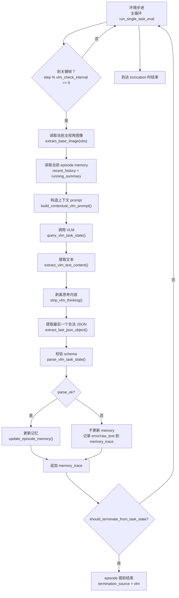

# Contextual VLM Memory Architecture

当前这套记忆系统是一个“关键帧触发的轻量上下文记忆层”。它的目标不是让 VLM 记住所有历史，而是让它在每次关键判断时，带着一份压缩过的最近上下文，稳定地回答“当前任务是否已经完成”。

系统的核心设计有 6 个点。

## 1. 输入不是单帧裸图，而是“图像 + 任务 + 历史记忆”

每到 `vlm_check_interval` 指定的关键帧，系统会把这几类信息一起发给 VLM：

- 当前主视角图像
- 当前任务描述
- 一条 `running_summary`
  含义：到上一轮为止，对任务状态的压缩总结
- 一个 `recent_history`
  含义：最近几次关键帧的短摘要列表

对应实现主要在 `vlm_eval/vlm_memory.py` 的 `build_contextual_vlm_prompt()` 和 `simple_eval_libero10_pi05.py` 的主循环里。

## 2. 记忆分成“短历史 + 运行摘要”两层

现在的 memory 结构很轻，只保留：

- `recent_history: list[str]`
- `running_summary: str`

它不保存复杂子目标树，也不做长期全文回放。

更新规则是：

- 这一帧 VLM 返回的 `frame_state.summary` 追加进 `recent_history`
- 这一帧 VLM 返回的 `task_memory.state_summary` 覆盖 `running_summary`
- `recent_history` 只保留最近 `K=3`

这样做的目的是避免上下文无限膨胀，同时保留最近状态变化。

对应实现见 `vlm_eval/vlm_memory.py` 的：

- `init_episode_memory()`
- `update_episode_memory()`
- `snapshot_episode_memory()`

## 3. VLM 输出被约束成固定 schema

模型不能自由输出一大段结论，而是要求输出固定 JSON：

```json
{
  "frame_state": {"summary": "..."},
  "task_memory": {"state_summary": "..."},
  "decision": {
    "terminate": false,
    "status": "in_progress|completed|uncertain",
    "reason": "..."
  }
}
```

这三块分别对应：

- `frame_state`
  当前帧看到的任务相关状态
- `task_memory`
  给下一次判断用的压缩记忆
- `decision`
  本次是否完成的判断

这能把“观察”“记忆更新”“完成判断”拆开，减少模型直接跳结论的漂移。

## 4. 解析层是防御式的，不信任模型原始输出

VLM 输出经常会混入思考过程、代码块、重复 JSON，所以现在解析逻辑是：

- 先取响应里的文本内容
- 如果有 `</think>`，只保留它后面的内容
- 在剩余文本里扫描所有合法 JSON 对象
- 取最后一个合法 `dict` 作为最终输出
- 再校验字段是否满足 schema

只有全部通过时，`parse_ok=True`。否则记为失败，不更新记忆。

对应实现见 `vlm_eval/vlm_memory.py`：

- `extract_vlm_text_content()`
- `strip_vlm_thinking()`
- `extract_last_json_object()`
- `parse_vlm_task_state()`

## 5. 记忆更新有保护机制

如果本次 VLM 输出解析失败：

- 不更新 `recent_history`
- 不更新 `running_summary`
- 只记录错误和原始文本
- episode 继续跑

所以坏输出不会污染后续记忆。

这个保护逻辑就在 `vlm_eval/vlm_memory.py` 的 `update_episode_memory()` 里，关键判断是：

`if not parse_ok: return`

## 6. episode 结束只看 VLM 和截断，不再看 env done

当前系统已经把 env 的成功终止信号禁掉了。

现在 episode 只会因为两种情况结束：

- 到达环境的 `truncation`
- VLM 返回：
  - `decision.terminate == true`
  - `decision.status == "completed"`
  - `decision.reason` 非空

这样做的目的是把“任务完成判定权”收敛到 VLM 记忆链路本身。

对应实现见：

- `simple_eval_libero10_pi05.py`
- `vlm_eval/vlm_memory.py` 的 `should_terminate_from_task_state()`

## 架构图


